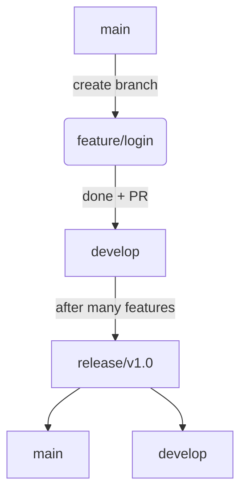

Dưới đây là nội dung chi tiết cho:

---

# ✅ Lesson 18 – Explaining Git Workflow

> 📘 **Mục tiêu bài học:**

* ✅ Nắm được từ vựng chuyên ngành để mô tả quy trình sử dụng Git.
* ✅ Tự tin giải thích cách nhóm làm việc với nhánh, merge, pull request...
* ✅ Viết và nói rõ ràng về Git workflow trong bối cảnh nhóm phát triển phần mềm.

---

## 📚 Từ vựng chính (IPA + nghĩa)

| Từ vựng / Cụm từ          | Phiên âm IPA        | Nghĩa                            |
| ------------------------- | ------------------- | -------------------------------- |
| workflow                  | /ˈwɜːk.fləʊ/        | quy trình làm việc               |
| branching                 | /ˈbrɑːn.tʃɪŋ/       | chia nhánh                       |
| feature branch            | /ˈfiː.tʃər brɑːntʃ/ | nhánh tính năng                  |
| main branch (main/master) | /meɪn brɑːntʃ/      | nhánh chính (main hoặc master)   |
| pull request (PR)         | /pʊl rɪˈkwest/      | yêu cầu merge vào nhánh chính    |
| merge                     | /mɜːdʒ/             | hợp nhất nhánh                   |
| conflict                  | /ˈkɒn.flɪkt/        | xung đột                         |
| code review               | /kəʊd rɪˈvjuː/      | đánh giá mã                      |
| approve                   | /əˈpruːv/           | chấp nhận, phê duyệt             |
| release branch            | /rɪˈliːs brɑːntʃ/   | nhánh dùng để chuẩn bị phát hành |

---

## 🗣️ Câu mẫu thực tế

### 1. Giải thích quy trình:

* Our team follows a Git **workflow** that includes feature branches and pull requests.
* We always create a new **branch** when starting a new feature or bug fix.
* Once the work is done, we create a **pull request** to merge into `develop`.

### 2. Mô tả thao tác:

* I usually start by creating a new **feature branch** from `develop`.
* After I push the changes, I open a **PR** and ask for a **code review**.
* When the PR is approved, I **merge** the branch into the main branch.

### 3. Phản ứng khi có vấn đề:

* We sometimes face **merge conflicts**, especially when multiple people work on the same file.
* If that happens, we try to resolve the conflict manually and test everything again.

---

## ✍️ Bài luyện viết (Writing Practice)

> Viết một đoạn mô tả Git workflow mà bạn đang hoặc đã từng sử dụng trong nhóm (5–7 câu).

**Gợi ý mẫu:**

> In my team, we follow a Git workflow where every task starts with a new feature branch.
> Developers push their changes and open a pull request for review.
> We use GitHub to assign reviewers and leave comments.
> After the code is approved, we merge the branch into `develop`.
> Before release, we create a release branch and merge it into `main` and `develop`.

---

## 🎤 Bài luyện nói (Speaking Practice)

> Trả lời các câu hỏi sau bằng tiếng Anh:

1. What Git workflow does your team follow?
2. How do you handle conflicts during merging?
3. Do you use any tools for code review and pull requests?

**Gợi ý mở đầu:**

* “Our team uses Git Flow with develop, feature, and release branches…”
* “If there’s a conflict, we resolve it manually, then test again…”
* “We use GitHub for pull requests and assign teammates for code review…”

---

## 🧠 Ghi chú mở rộng

### 🔄 Git Flow - một workflow phổ biến:

* **main**: nhánh dùng để deploy production
* **develop**: nhánh tích hợp các tính năng mới
* **feature/**: nhánh con dùng để làm từng task
* **release/**: nhánh chuẩn bị phát hành
* **hotfix/**: dùng khi cần sửa lỗi khẩn cấp

---

Bạn muốn tiếp tục Lesson 19 – “Code Review & Giving Feedback” không?
